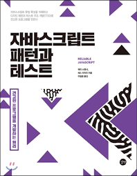

# 자바스크립트 패턴과 테스트 

## 목차

### 1부 기초 다지기
1. [좋은 소프트웨어 만들기](./1부_기초_다지기/01_좋은_소프트웨어_만들기.md)
2. [도구 다루기](./1부_기초_다지기/02_도구_다루기.md)
3. 객체를 바르게 만들기

### 2부 패턴을 응용한 코드 테스팅
4. 패턴이 좋은 점
5. 콜백 패턴
6. 프라미스 패턴
7. 부분 적용 함수
8. 메모이제이션 패턴
9. 싱글톤 패턴
10. 팩토리 패턴
11. 샌드박스 패턴
12. 장식자 패턴
13. 전략 패턴
14. 프록시 패턴
15. 체이너블 메서드

### 3부 자바스크립트 고급 특성을 응용한 테스팅과 코딩
16. 인터페이스 없는 언어에서 인터페이스에 맞추기
17. 인자 타입 확실히 하기
18. call, apply, bind 삼인방
19. 메서드 빌림
20. 믹스인
21. 고급 프로그램 아키텍처 테스팅

### 4부 고급 테스팅
22. DOM 접근 테스팅
23. 표준에 맞추기

### 5부 총정리
24. 테스트 주도 개발 원칙 정리
25. 자바스크립트 관용 구문 정리
